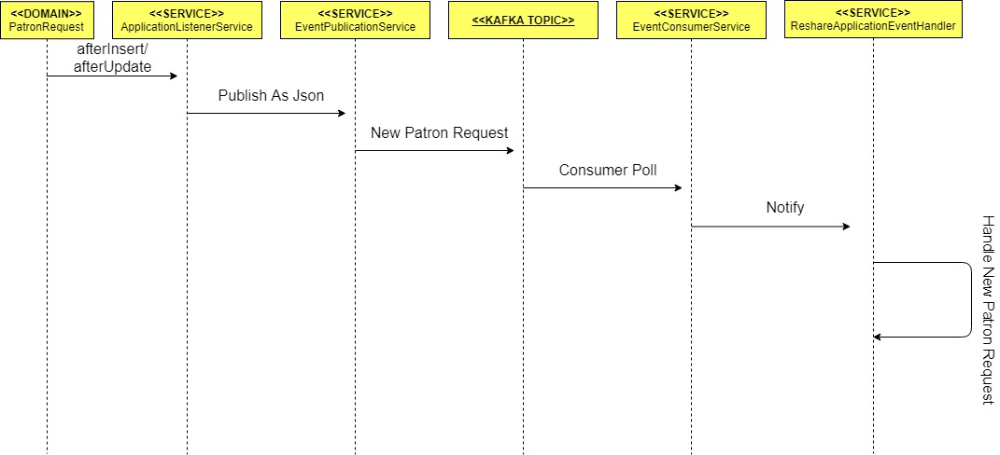

# Event Propogation

## Event Walkthrough

1. Patron Request

		When creating a new patron request, after checking that the request is not in fact from a requester, the status is set to IDLE, and *afterInsert* is called, which pushes command onto *ApplicationListenerService*.
			
2. Application Listener Service

		Inside *afterInsert*, the event title, tenant, oid, id and title are set, and this object is then published as a JSON  inside the Event Publication Service.
			
3. Event Publication Service

			This takes the information about the new patron request, and sends it to a Kafka topic outside the scope of this module.
			
4. Kafka Topic

			The information is updated on the topic, and from there the Event Consumer Service grabs that data.
			
5. Event Consumer Service

			Within here the *consumePatronRequestEvents* is called, and this first checks to see if there are any current tenants. If not then it returns a dummy topic, else it slurps the JSON data before notifying the *PREventIndication*, calling a method in Reshare Application Event Handler.
					
6. Reshare Application Event Handler

			This service takes the event data handed to it by the Event Consumer Service, and then will eventually validate it. Right now it simply sets the status from IDLE to VALIDATED and saves the data to the database. From there it currently draws that information back out and changes the state again to SOURCING_ITEM, forcing the chain to begin again, but with the difference being that it will now begin with an *afterUpdate* call

## Event Sequence Diagram

